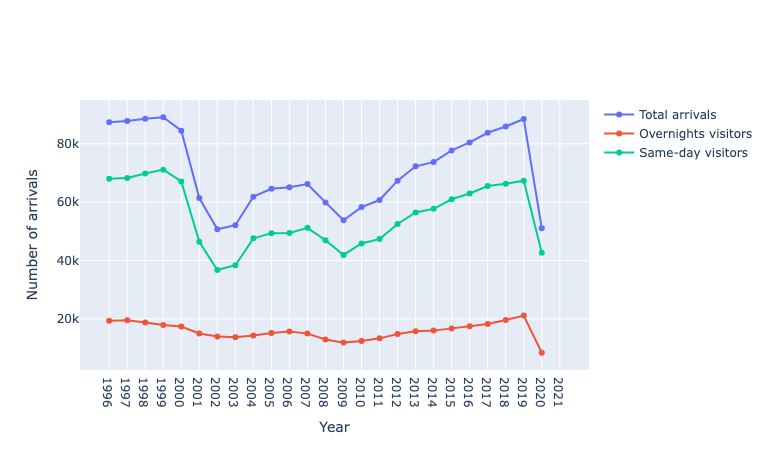
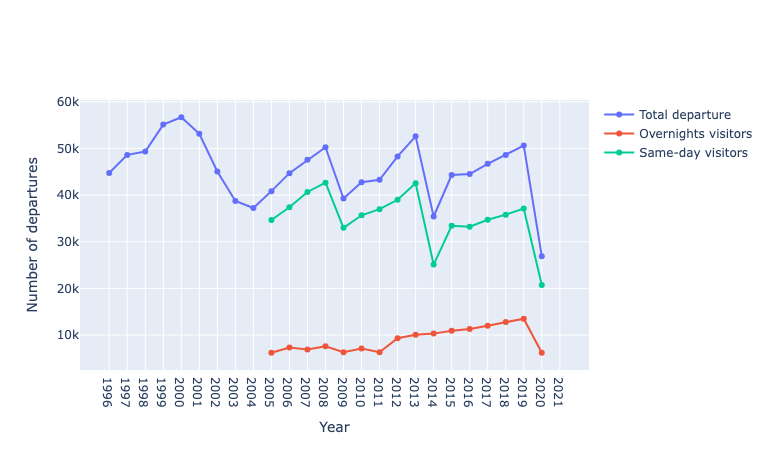
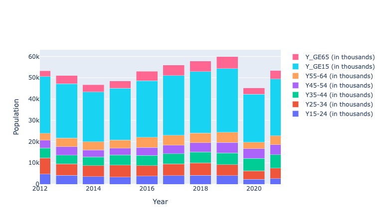
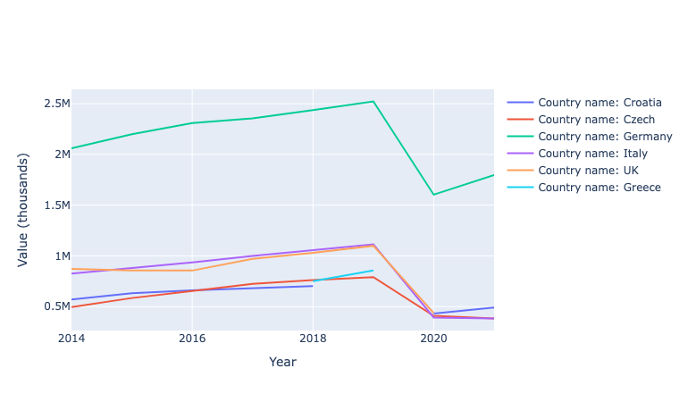
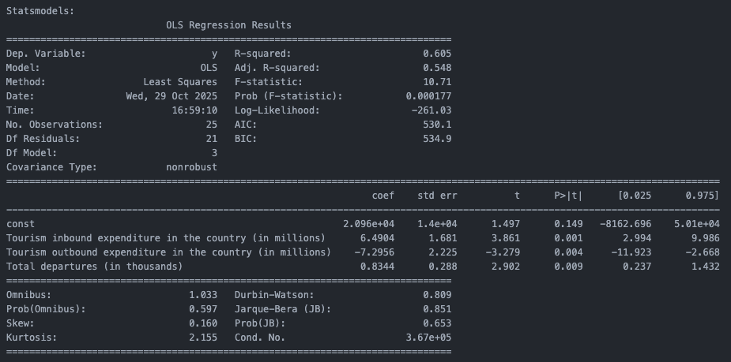

# 📊  Tourism Data Analysis in Poland 

## 🧭 Project Overview

This project presents a comprehensive analysis of tourism data in Poland. Built with **Python** and **Dash**, it enables interactive visualization of trends in arrivals and departures, tourist expenditures, demographic analysis of visitors, and the most popular travel destinations.

## 🧠 Business Problem

Tourism plays a key role in Poland's economy, influencing revenue, employment, and infrastructure development. Understanding trends in tourist arrivals, departures, spending behavior, and demographic patterns is crucial for government agencies, travel companies, and policymakers. This project aims to provide actionable insights into tourism trends and support data-driven decision-making in the tourism sector.

## 🗃️ Dataset Description
The dataset covers **tourism indicators for Poland between 1995 and 2021**, including information on arrivals, departures, expenditures, demographics, and travel behavior.  
All values are expressed in **thousands (for counts)**, **millions (for expenditures)**, or **nights (for average stay)**.

| **Category / Variable** | **Description** |
|--------------------------|-----------------|
| **Total arrivals** | Total number of international visitors arriving in Poland each year. |
| **Overnight visitors (tourists)** | Visitors staying at least one night during their trip. |
| **Same-day visitors (excursionists)** | Travelers who do not stay overnight. |
| **Tourism inbound expenditure** | Total spending by foreign tourists in Poland. |
| **Travel inbound / Transport inbound** | Breakdown of inbound spending into travel and passenger transport categories. |
| **Total departures** | Number of Polish residents traveling abroad. |
| **Overnight visitors (outbound)** | Polish tourists staying overnight abroad. |
| **Same-day visitors (outbound)** | Polish residents traveling abroad for one day or less. |
| **Tourism outbound expenditure** | Total spending by Polish residents abroad. |
| **Travel outbound / Transport outbound** | Breakdown of outbound expenditure by type of expense. |
| **Arrivals by main purpose** | Total arrivals categorized by purpose of visit (personal, business, or professional). |
| **Average length of stay** | Average number of nights spent per visitor. |
| **Top destinations (Croatia, Czech Republic, Germany, Italy, UK, Greece)** | Most frequently visited countries by Polish tourists. |
| **Population** | Annual total population of Poland. |
| **Age groups (Y_GE15, Y15-24, Y25–34, Y35–44, Y45–54, Y55–64, Y_GE65)** | Number of travelers by age category. |
| **Gender (Female, Male)** | Number of tourists by gender. |

**Time range:** 1995–2021  
**Geographic scope:** Poland (inbound and outbound tourism)  
**Frequency:** Annual  
**Data source:** Central Statistical Office of Poland (GUS) and Eurostat public tourism statistics.  

## ⚙️ Key Features

- **Data Cleaning and Preparation:** Handling missing values, type conversion, removing spaces and formatting issues.  
- **Interactive Visualizations:**  
  - Tourist arrivals and departures
    
    
  - Domestic and outbound travel expenditures
  - Age group analysis of tourists
    
  - Top travel destinations
    
- **Statistical Modeling:** Linear regression predicting tourist arrivals, with evaluation metrics (R², MSE, F1-score, accuracy).
   
- **Interactive Dashboard:** Filterable data tables and dynamic charts using dropdown menus.

## 🧰 Technologies
- **Python** - Core programming language
- **Pandas, NumPy** - Data manipulation and processing
- **Plotly, Dash** - Interactive visualizations and dashboard
- **Scikit-learn, Statsmodels** - Regression modeling and evaluation

## 📈 Key Insights
- The highest growth in tourist arrivals occurred before 2000, followed by a decline, with stable growth since 2009.  
- Day-trip tourism dominates arrivals to Poland.  
- The regression model explains approximately 60% of the variance in tourist arrivals, indicating a good fit.

## 🌐 Links
- [View Deployed App on Render](https://project-5-6mio.onrender.com/)
- [Python Script](project.py)
  

## 🏷️ Tag: `Python` `Tourism Analysis` `Web App` `Data Visualization`
